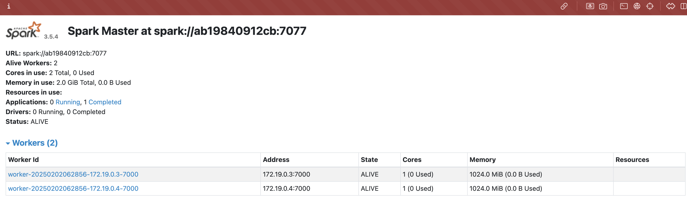
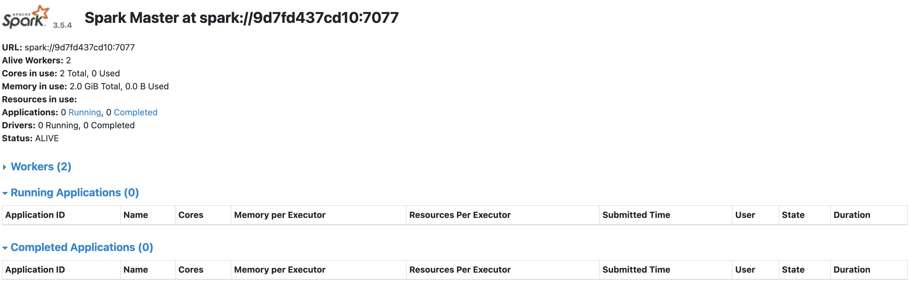
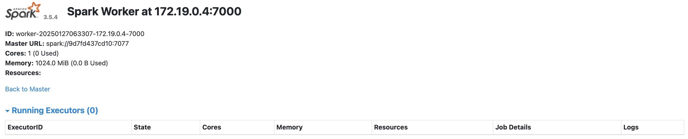
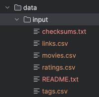
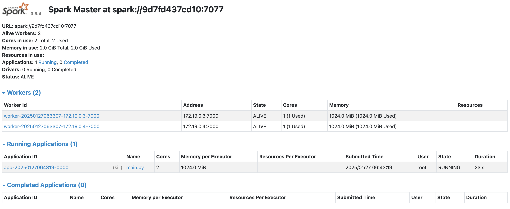

# Spark Cluster with Docker


# General

A simple spark standalone cluster for your testing environment purposses. A *docker-compose up* away from you solution for your spark development environment.

The Docker compose will create the following containers:

container|Exposed ports
---|---
spark-master|9090 7077
spark-worker-1|9091
spark-worker-2|9092

### Version

* dokcer version: 27.4.0 
* spark version: 3.5.4
* python version: 3.12.8

# Installation

The following steps will make you run your spark cluster's containers.

## Pre requisites

* Docker Desktop installed


# Spark Standalone mode

## change directory to standalone
```sh
cd cluster/standalone
```

## build the image
```sh
docker build -t cluster-apache-spark:3.5.4 .
```

## Run the docker-compose

The final step to create your test cluster will be to run the compose file:

```sh
docker compose up -d
```

## Validate your cluster

Just validate your cluster accesing the spark UI on each worker & master URL.

### Spark Master

http://localhost:9090/



### Spark Worker 1

http://localhost:9091/



### Spark Worker 2

http://localhost:9092/




## Resource Allocation 

This cluster is shipped with three workers and one spark master, each of these has a particular set of resource allocation(basically RAM & cpu cores allocation).

* The default CPU cores allocation for each spark worker is 1 core.

* The default RAM for each spark-worker is 1024 MB.

* The default RAM allocation for spark executors is 256mb.

* The default RAM allocation for spark driver is 128mb

* If you wish to modify this allocations just edit the env/spark-worker.sh file.

## Bound Volumes

To make app running easier I've shipped two volume mounts described in the following chart:

Host Mount|Container Mount|Purposse
---|---|---
apps|/opt/workspace/apps|Used to make available your app's jars on all workers & master
data|/opt/workspace/apps| Used to make available your app's data on all workers & master


# Run Sample applications

## favorite movies from MovieLens data [pyspark]

### download data
download & unzip [movielens data](https://files.grouplens.org/datasets/movielens/ml-32m.zip) to `data/input` dir.

it should look like



### submit spark job
```sh
docker exec docker-spark-cluster-spark-master-1 /opt/spark/bin/spark-submit \
--master spark://spark-master:7077 \
--driver-memory 1G \
--executor-memory 1G \
/opt/workspace/apps/main.py
```
You will notice on the spark-ui a driver program and executor program running(In scala we can use deploy-mode cluster)

