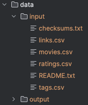
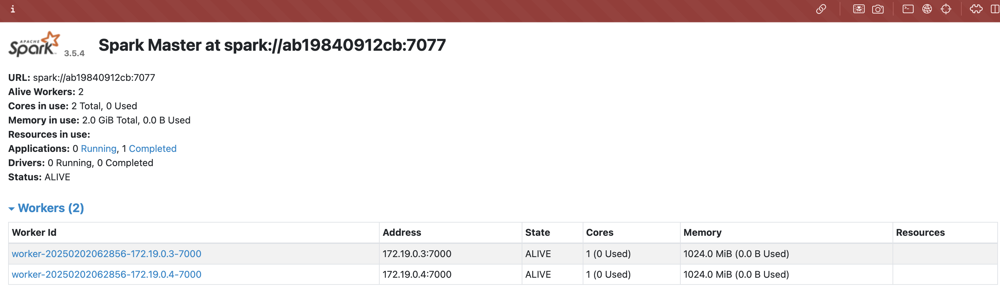
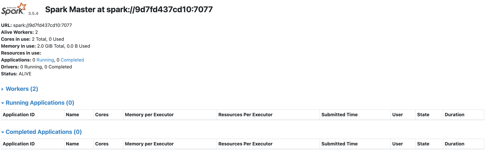
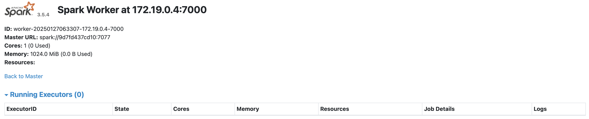
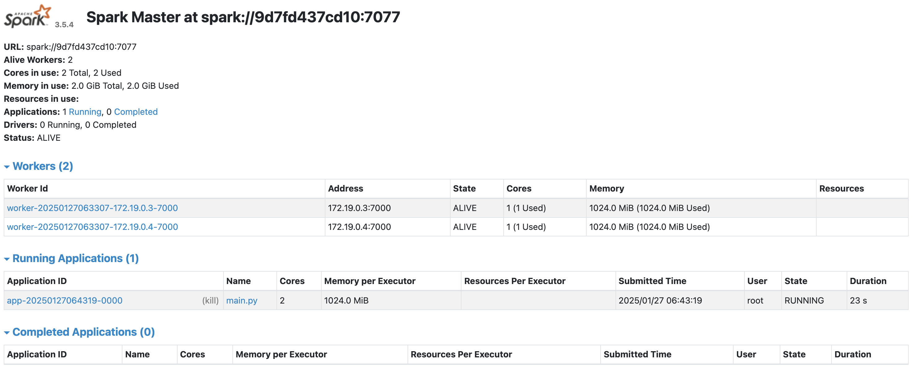

# Pre requisites

### 1. install Docker Desktop

### 2. download MovieLens data

(1) download & unzip [movielens data](https://files.grouplens.org/datasets/movielens/ml-32m.zip) to `data/input` dir.

(2) create `data/output` dir

```
mkdir data/output
```

it should look like




# Spark Standalone Cluster on Docker

## General

A simple spark standalone cluster for your testing environment purposses. A *docker-compose up* away from you solution for your spark development environment.

The Docker compose will create the following containers:

container|Exposed ports
---|---
spark-master|9090 7077
spark-worker-1|9091
spark-worker-2|9092

### Version

* dokcer version: 27.4.0 
* spark version: 3.5.6
* python version: 3.12.8

## Installation

The following steps will make you run your spark cluster's containers.

### change directory to standalone
```sh
cd cluster/standalone
```

### build the image
```sh
docker build -t spark-cluster-standalone:3.5.6 .
```

or pull image from Docker Hub
```sh
docker pull shinest/spark-cluster-standalone:3.5.6 

```

### Run the docker-compose

The final step to create your test cluster will be to run the compose file:

```sh
docker compose up -d
```

### Validate your cluster

Just validate your cluster accessing the spark UI on each worker & master URL.

#### Spark Master

http://localhost:9090/



#### Spark Worker 1

http://localhost:9091/



#### Spark Worker 2

http://localhost:9092/




## Run Sample applications

### submit spark job
```sh
docker exec standalone-spark-master-1 spark-submit \
--master spark://spark-master:7077 \
--driver-memory 1G \
--executor-memory 1G \
/opt/workspace/apps/main.py
```
You will notice on the spark-ui a driver program and executor program running(In scala we can use deploy-mode cluster)




### Resource Allocation 

This cluster is shipped with three workers and one spark master, each of these has a particular set of resource allocation(basically RAM & cpu cores allocation).

* The default CPU cores allocation for each spark worker is 1 core.

* The default RAM for each spark-worker is 1024 MB.

* The default RAM allocation for spark executors is 256mb.

* The default RAM allocation for spark driver is 128mb

* If you wish to modify this allocations just edit the env/spark-worker.sh file.

### Bound Volumes

To make app running easier I've shipped two volume mounts described in the following chart:

Host Mount|Container Mount|Purposse
---|---|---
apps|/opt/workspace/apps|Used to make available your app's jars on all workers & master
data|/opt/workspace/apps| Used to make available your app's data on all workers & master


## Stop Running Container
```bash
docker compose down
```

# Hadoop Spark Cluster on Docker

## Installation

The following steps will make you run your spark cluster's containers.

### change directory to standalone
```sh
cd cluster/hadoop
```

### build the image
```sh
docker build -t hadoop-cluster:3.4.1 .
```

or pull image from Docker Hub
```sh
docker pull shinest/hadoop-cluster:3.4.1
docker tag shinest/hadoop-cluster:3.4.1 hadoop-cluster:3.4.1 
```

### Run the docker-compose

The final step to create your test cluster will be to run the compose file:

```sh
docker compose -p data up -d
```

### Validate your cluster

Just validate your cluster accessing the spark UI on each worker & master URL.

#### name node

http://localhost:9870/dfshealth.html#tab-overview

#### YARN

http://localhost:8088/cluster


## Run Sample applications

### connect to master node
```sh
docker exec -it data-hadoop-master-1 /bin/bash
```

### push data dir to hdfs
```sh
hdfs dfs -mkdir -p /opt/workspace
hdfs dfs -put /opt/workspace/* /opt/workspace
```

### submit spark application
```bash
spark-submit --master yarn \
--deploy-mode client \
--driver-memory 512M \
--executor-memory 512M \
/opt/workspace/apps/main.py
```

You're able to check execute status on [YARN UI](http://localhost:8088/cluster).

## stop running container
```bash
docker compose -p data down
```


# Delta Lake tutorial
## run on local
### change directory to delta_lake_tutorial
```bash
cd apps/delta_lake_tutorial
```

### install python package
```bash
pip install -r requirements.txt
```

### start jupyter lab
```bash
jupyter lab
```

## run on docker
### change directory to delta_lake_tutorial
```bash
cd apps/delta_lake_tutorial
```
### build docker image
```bash
docker build -t delta-lake-tutorial:latest .
```

### run jupyter lab
```bash
docker run --rm -p 8889:8888 -v ./spark-warehouse:/opt/spark-warehouse/ delta-lake-tutorial:latest
```

### visit notebook page
http://localhost:8889/lab?token=nl-data